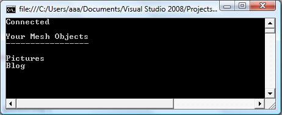
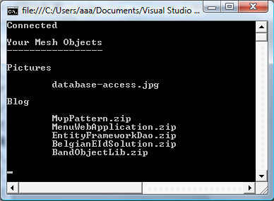

**Introduction**

In March I went to the Microsoft TechDays in Belgium. The last session I attended was about Microsoft's [Live Services](http://dev.live.com/) and the Live Framework used for programming against these services. To showcase all this the [Live Mesh](http://www.mesh.com) service was used.

Live Mesh allows you to easily synchronize files with all of your devices. I tend to visualize it as an online hard drive or repository where I can deposit files which I wish to share amongst my devices such as my laptop at work, my PDA...etc.

You simply have to sign up for a Mesh account and install the Live Mesh client on the devices you want to synchronize. Once the client has been installed all that remains is to add a local folder to Live Mesh. The client will then make sure this folder is synchronized automatically between all of your devices.

Your Live Mesh account allows you to manage the connected devices and Live Mesh folders. For example you can opt to choose between which devices you want to synchronize a certain folder.

When you place a new file into a Live Mesh folder, the client will upload this file to your online Mesh account. The clients on your other devices will be notified as soon as they are up and running and will synchronize with your online Mesh account. So you always have a copy of your data floating around somewhere on the cloud.

There is more to it than this, but this is the gist of it. The goal of this article is to demonstrate just how easy it is to use the Live Framework to program against the Live Mesh service. With a small amount of code you'll be able to create folders and store files in your Mesh account.

**Table Of Contents**

- [Introduction](#introduction)
- [Getting Started](#gettingstarted)
- [Live Framework Resource Model](#resourcemodel)
- [Connecting To The Live Services](#liveframework)
- [Listing Mesh Objects](#meshobjects)
- [Mesh Object Resources](#resources)
- [Creating A Directory](#createdirectory)
- [Adding A File](#addfile)
- [Retrieving A File](#retrievefile)
- [Summary](#summary)
- [Download](#download)

**Getting Started**

To get started you need to obtain the Live Framework Client. A separate sandbox environment has been setup for developers who wish to test and evaluate the Live Framework and the Live Services.

Since both are still in beta phase, you need to sign up for the community technology preview (CTP) program waiting list.

To do so just follow these steps:

1. Visit the [Live Mesh](https://www.mesh.com/) website
2. Click on the link [Developers](https://www.mesh.com/web/developer.aspx) listed at the bottom of the screen
3. Sign up for an account. You need to fill in the "Azure Services Invitations Program" form.

After registering for a [Windows Azure](http://www.microsoft.com/azure/windowsazure.mspx) account, you'll have to be patient and wait until the good folks at Microsoft mail you an invitation code. In my case it took about 6 hours, but I've heard from other people that they'd have to wait a couple of days or even weeks.

**Note**: How does Windows Azure relate to Mesh? Simple: The Windows Azure platform, which is Microsoft's platform for [cloud computing](http://en.wikipedia.org/wiki/Cloud_computing), contains the Live Services which power Mesh. Using the Live Services API allows you to program against Mesh. Take a look at this [blog post](http://blogs.msdn.com/livemesh/archive/2008/10/27/how-does-live-mesh-relate-to-azure.aspx) for more information.

After obtaining a Windows Azure account, you'll get an invitation code for the Microsoft .NET Services and Microsoft SQL Services. After activating this invitation code you can request another one for the Live Services. You can register for a Live Services account at the [Azure Services Developer Portal](//lx.azure.microsoft.com/).

It's quite a hassle and you'll have to wait for about a week for all the invitation codes to be sent. Last but not least you'll need to get access to the [developer version of Live Mesh](https://developer.mesh-ctp.com/). Be aware, this version is different from the [consumer version](//www.mesh.com) of Live Mesh! Both operate in their own sandbox. If you wish to install them side by side, please consult this [forum post](http://social.msdn.microsoft.com/Forums/en-US/liveframework/thread/2fa9d3f1-029e-44af-9568-1cea81ca78a9).

The required software (SDK & Tools) and documentation for programming against the Live Framework Mesh can be downloaded [here](https://developer.mesh-ctp.com/developers/developers.aspx).

You can recognize the Developer Live Mesh client by this icon in the system tray.

**Figure 1** - Live Mesh Developer Client System Tray Icon 

After all accounts have been created and the SDK has been setup you're finally ready to go...

**Note**: To setup these accounts you'll need to use your Windows Live Id.

[Mike Tautly](http://mtaulty.com/communityserver/blogs/mike_taultys_blog/default.aspx) has put up a nice screencast on how to get started with Live Mesh, [check it out here](http://channel9.msdn.com/posts/mtaulty/Live-Framework-SDK-Getting-Started/).

[Top of page](#top)

**Live Framework Resource Model**

Before proceeding further a bit of information on the storage hierarchy of Mesh is advisable. The Live Framework encapsulates more than just Mesh as you can see in the following image.

**Figure 2** - Live Framework Resource Model

Let's focus solely on Mesh. Using a bottom-up approach the first item of interest is the data entry object. A data entry is the actual data stored in your Mesh, it can be a picture, a pdf, zip archive...etc. You are not confined to only storing files. You can, for example, also store objects as data entries.

Moving up one level you can see that a collection of data entries is maintained by a data feed, which in its turn is part of a mesh object. A data feed is usually a collection of data entries of the same type. So a data feed might be a collection of data entries which all represent pictures. I say usually, because it is really up to you to determine what you want to store in the data entries.

A mesh object (MeshObject class) describes the object that you want to share. There is one MeshObject for each object (e.g. folder) that you want to synchronize between your devices. Each MeshObject can have one or more data feeds and each data feed can have one or more data entries.

Just like with the data entries you determine how many data feeds a MeshObject contains and what kind of collections (data entries) these feeds contain. So a MeshObject describes an object that you wish to share and synchronize between your devices. It defines what to share and amongst which devices, a.k.a. the mapping.

To recap, for synchronizing folders and files, Mesh adds a single MeshObject for each Live Mesh folder. Each MeshObject has one data feed which contains a collection of data entries. The data entries are the actual files stored in the folder.

[Top of page](#top)

**Connecting To The Live Services**

The source code accompagnying this article aims at demonstrating how to establish a connection with the Live Services, querying and creating resources (directories) and uploading / downloading a file.

**Note**: The purpose of the source code is to show how to operate with Live Mesh through the Live Framework API, not on how to write robust code. So exception handling and such is skipped. Feel free to add your own.

Well, for starters let's begin with the initial task of establishing a connection. Connecting to the Live Services is as easy as following these steps:

1. Start up Visual Studio 2008 (be sure to check if you have [SP1](http://msdn.microsoft.com/en-us/vstudio/cc533448.aspx) installed)
2. Create a new blank solution called "LiveMesh" and add a console project aptly named ConsoleApplication
3. Add references to the following Dll assemblies which are part of the Live Framework SDK:Microsoft.LiveFX.Client.dll, Microsoft.LiveFX.ResourceModel.dll and Microsoft.Web.dll.If you used the default installation location they should be located in the following directory: "C:\\Program Files\\Microsoft SDKs\\Live Framework\\v0.91\\API Toolkits\\.Net Library"
4. Add a new class called LiveMesh to the project. Listing 1 lists the code for this class.

**Listing 1** - LiveOperatingEnvironment class (LOE)

public class LiveMesh
{
  #region Fields

  private const string serverUri = "https://user-ctp.windows.net";
  private readonly LiveOperatingEnvironment environment = new LiveOperatingEnvironment();

  #endregion

  #region Constructor(s)

  public LiveMesh(string userName, string password)
  {
      UserName = userName;
      Password = password;
  }

  #endregion

  #region Properties

  public string UserName { get; set; }
  public string Password { get; set; }

  #endregion

  #region Methods

  public bool Connect()
  {
      // Using the LiveItemAccessOptions class you can specify if you want to auto-load
      // relations and if you wish to receive notifications.
      LiveItemAccessOptions options = new LiveItemAccessOptions(true);

      // Create a user token. You  need to pass a token based on your Windows Live Id
      // to the LOE object's connect method. The GetWindowsLiveAuthenticationToken() is
      // an extension method which resides in the Microsoft.LiveFX.ResourceModel namespace.
      string credential = new NetworkCredential(UserName, Password, serverUri).GetWindowsLiveAuthenticationToken();

      // Connect and retrieve the Mesh object
      environment.Connect(credential, AuthenticationTokenType.UserToken, new Uri(serverUri), options);

      // When connected the Mesh property of the LOE object will be set.
      return environment.Mesh != null;
  }

  #endregion
}

This class has a constructor which takes two strings, namely the username and password of your Windows Live Id. The variable serverUri contains the address of the Live Framework server to which you need to connect.

Everything in this class (which will be expanded in the rest of this text) pretty much revolves around the LiveOperatingEnvironment (LOE) class, it is the main entry point into the Live Framework.

The LiveMesh class's Connect method in turn calls the LOE class' Connect method which takes a user token, the server Uri and some options. Read the comments in the code segment above for more information on how these parameters are configured.

Let's quickly test the LiveMesh class. The code in Listing 2 doesn't need any further explanation.

**Listing 2**\- Connecting to your Mesh

using System;

namespace ConsoleApplication
{
    class Program
    {
        private const string userName = "xxxxx@xxxxx.com";
        private const string password = "xxxxx";

        static void Main(string\[\] args)
        {
            LiveMesh myMesh = new LiveMesh(userName, password);

            bool connected = myMesh.Connect();
            if (connected)
            {
                Console.WriteLine("Connected");
            }
            else
            {
                Console.WriteLine("Could not establish connection");
            }

            Console.ReadLine();
        }
    }
}

**Note**: Don't forget to replace the userName and password values with your own.

[Top of page](#top)

**Listing Mesh Objects**

To list the objects present in your Mesh a simple Linq query suffices. Add the following method to your LiveMesh class.

**Listing 3** - GetMeshObjects() method

public class LiveMesh
{
    // ...
    
    #region Methods

    public IEnumerable<MeshObject> GetMeshObjects()
    {
        return from o in environment.Mesh.CreateQuery<MeshObject>().Execute()
               select o;
    }

    #endregion
    
    // ...
}

As you can see the Linq query follows the pattern shown in figure 2, the Live Framework Resource Model. The Mesh property of the LiveOperatingEnvironment instance is queried and all the Mesh objects are returned (Service Endpoint -> Mesh -> Mesh Objects). Now let's foreach this collection and take a look at the results.

**Listing 4** - Foreaching the Mesh objects

// List the MeshObjects in your Mesh
IEnumerable<MeshObject> meshObjects = myMesh.GetMeshObjects();
foreach(var meshObject in meshObjects)
{
    Console.WriteLine(meshObject.Resource.Title);
}

The output:

**Figure 3** - My Mesh Objects

The folders "Pictures" and "Blog" were two folders I created using the Live Mesh Developer version website (Live Desktop). Feel free to create your own folders using the site and check if they show up in the query results.

There are two ways to query Mesh. You could also rewrite the query shown in Listing 3 as such:

**Listing 5** - CreateQuery<T> Versus Entries

return from o in environment.Mesh.MeshObjects.Entries select o;

What's the difference? CreateQuery<T> executes server side while using the Entries collection will be executed client-side. The latter case will result in more objects being sent over the wire. For a more in-depth explanation check out this [excellent blog post](http://blogs.msdn.com/benwilli/archive/2009/03/09/linqing-to-the-live-framework.aspx).

**Note**: If you only want to return Mesh objects which are folders, then add this where clause: where o.Resource.Type == "LiveMeshFolder".

[Top of page](#top)

**Mesh Object Resources**

Now that you know how to obtain your Mesh objects, let's retrieve the resources (data entries) of such a Mesh object. In order words let's list the files of a Live Mesh folder.

Add the method shown in Listing 6 to your LiveMesh class.

**Listing 6** - GetFilesOfFolder() method

public IEnumerable<DataEntry> GetFilesOfFolder(MeshObject meshObject)
{
    // Obtain the data feed. 
    // A Mesh Object representing a folder only has one data feed.
    // It's title is LiveMeshFiles.
    DataFeed feed = (from f in meshObject.CreateQuery<DataFeed>().Execute()
                     where f.Resource.Title == "LiveMeshFiles" 
                     select f).First();
    if (feed == null)
    {
        throw new InvalidOperationException("MeshObject does not have any data feeds");
    }
    return from e in feed.CreateQuery<DataEntry>().Execute() select e;
}

Let's update the foreach loop in the Main method.

**Listing 7** - Updated Main method

// ...

// List the MeshObjects in your Mesh
IEnumerable<MeshObject> meshObjects = myMesh.GetMeshObjects();
foreach(var meshObject in meshObjects)
{
    Console.WriteLine(meshObject.Resource.Title);
    Console.WriteLine();

    IEnumerable<DataEntry> files = myMesh.GetFilesOfFolder(meshObject);
    foreach(var file in files)
    {
        Console.WriteLine(String.Format("\\t{0}", file.Resource.Title));
    }
    Console.WriteLine();
}

// ...

**Figure 4** - Mesh Object Resources (files)

Just place some files in your Mesh folders using the Live Desktop to test this code.

[Top of page](#top)

**Creating A Directory**

Great, you can now query your Mesh objects and their resources. But how about actually creating a folder without resorting to the Live Desktop?

Again, a short and simple amount of code is all you need. Add the following two methods to your LiveMesh class.

**Listing 8** - DirectoryExists() and CreateDirectory() methods

public bool DirectoryExists(string directory)
{
    var q = (from o in environment.Mesh.CreateQuery<MeshObject>().Execute()
             where o.Resource.Type == "LiveMeshFolder" && o.Resource.Title == directory
             select o).FirstOrDefault();
    return q != null;
}

public void CreateDirectory(string directory)
{
    // Do not create the directory if it already exists
    if (DirectoryExists(directory))
    {
        return;
    }

    // Create a new Mesh object and set its type
    MeshObject newDirectory = new MeshObject(directory) {Resource = {Type = "LiveMeshFolder"}};

    // Add the new object to your Mesh
    environment.Mesh.MeshObjects.Add(ref newDirectory);

    // Create a data feed, set its type and handler
    DataFeed feed = 
        new DataFeed("LiveMeshFiles") 
        { Resource = { Type = "LiveMeshFiles", HandlerType = "FileSystem" } };

    // Add the data feed to the new Mesh object
    newDirectory.DataFeeds.Add(ref feed);
}

The method DirectoryExists() checks if a folder already exists within Mesh, the second method CreateDirectory() creates a new folder and adds a data feed to it.

**Note**: The code contains some hardcoded strings such as LiveMeshFolder, LiveMeshFiles, FileSystem...etc. Feel free to improve on the design (make them constants for example), but these strings are needed if you want to retrieve / create the correct Mesh objects. Mesh allows you to store more than just folders and files.

[Top of page](#top)

**Adding A File**

To enable your LiveMesh class to add files to a folder add the methods shown in Listing 9 to the class.

- **FindDirectory()**: This method checks if a given directory exists in your Mesh and returns the MeshObject if found.
- **GetMimeType()**: Determines the mime type of a file.
- **AddFileToDirectory()**: Retrieves the MeshObject for a Live Mesh folder, loads its data feed and adds a new file to the feed's data entries.

**Listing 9** - Adding A File

public MeshObject FindDirectory(string directory)
{
    return (from o in environment.Mesh.CreateQuery<MeshObject>().Execute()
            where o.Resource.Type == "LiveMeshFolder" &&
                  o.Resource.Title == directory
            select o).FirstOrDefault();
}

private static string GetMimeType(string path)
{
    string mimeType = "application/unknown";
    string ext = Path.GetExtension(path).ToLower();
    Microsoft.Win32.RegistryKey regKey = Microsoft.Win32.Registry.ClassesRoot.OpenSubKey(ext);
    if (regKey != null && regKey.GetValue("Content Type") != null)
    {
        mimeType = regKey.GetValue("Content Type").ToString();
    }
    return mimeType;
}

public void AddFileToDirectory(string directory, string path)
{
    MeshObject meshObject = FindDirectory(directory);
    if (meshObject == null)
    {
        return;
    }
    DataFeed feed = (from f in meshObject.CreateQuery<DataFeed>().Execute()
                     where f.Resource.Type == "LiveMeshFiles"
                     select f).First();
    Stream fileStream = File.Open(path, FileMode.Open, FileAccess.Read);
    feed.DataEntries.Add(fileStream, path, GetMimeType(path));
    // Make sure all devices will get synchronized.
    feed.SyncEntries.Synchronize();
    feed.Update();
}

You can now add a file to a Live Mesh folder by calling the AddFileToFolder(directory, path) and the file will be uploaded to your Mesh. Check the Online Desktop to verify that it has been uploaded.

**Listing 10** - Uploading About.txt

// ...
myMesh.AddFileToDirectory("My new folder", "About.txt");
// ...

[Top of page](#top)

**Retrieving A File**

We're almost there. The only thing that remains to be done is to retrieve a file from Mesh. The GetFileByFilename() method shown in Listing 11 allows you to do just that.

It queries all the Mesh objects and returns the first data entry whose resource title matches the given filename.

**Listing 11** - GetFileByFilename() method

public DataEntry GetFileByFilename(string filename)
{
    IEnumerable<MeshObject> meshObjects = GetMeshObjects();
    foreach(var meshObject in meshObjects)
    {
        DataFeed feed = (from f in meshObject.CreateQuery<DataFeed>().Execute()
                         where f.Resource.Type == "LiveMeshFiles"
                         select f).First();
        if (feed != null)
        {
            DataEntry dataEntry = (from e in feed.CreateQuery<DataEntry>().Execute()
                                   where e.Resource.Title == filename
                                   select e).FirstOrDefault();
            if (dataEntry != null)
            {
                return dataEntry;
            }
        }
    }
    return null;
}

For example let's search for the text file About.txt which we added in the previous section.

**Listing 12** - Retrieving a file

// Retrieve a file
DataEntry dataEntry = myMesh.GetFileByFilename("About.txt");
if (dataEntry != null)
{
    MemoryStream stream = new MemoryStream();
    dataEntry.ReadMediaResource(stream);
    stream.Seek(0, SeekOrigin.Begin);
    StreamReader reader = new StreamReader(stream);
    Console.WriteLine(reader.ReadToEnd());
}

Once the DataEntry has been found you can call its ReadMediaResource() method to obtain a stream. The rest of the code reads the stream and writes the contents to the console.

[Top of page](#top)

**Summary**

I hope you enjoyed this brief introduction to Live Mesh and the Live Framework. Let's recap what we've covered from a developer's point of view:

- Connecting to the Live Operating Environment (Live Services)
- Listing resources (directories)
- Add (uploading) files to Mesh
- Retrieving (downloading) files from Mesh

Any comments, questions, tips...etc. are always appreciated.

[Top of page](#top)

**Download**

You can find the source code for this article on the [Download page](http://cgeers.wordpress.com/download/) of this blog.

[Top of page](#top)
